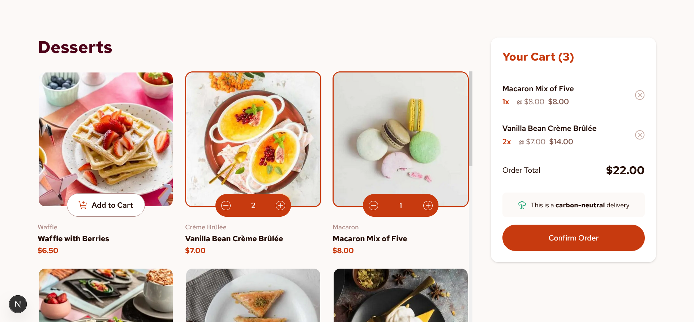

# Frontend Mentor - Product list with cart solution

This is a solution to the [Product list with cart challenge on Frontend Mentor](https://www.frontendmentor.io/challenges/product-list-with-cart-5MmqLVAp_d). Frontend Mentor challenges help you improve your coding skills by building realistic projects.

## Table of contents

- [Overview](#overview)
  - [Screenshot](#screenshot)
  - [Links](#links)
  - [Built with](#built-with)
  - [Continued development](#continued-development)

## Overview

This is a solution to the Product list with cart challenge on Frontend Mentor. Users of the app are able to:

- Add items to the cart and remove them
- Increase/decrease the number of items in the cart
- See an order confirmation modal when they click "Confirm Order"
- Reset their selections when they click "Start New Order"
- View the optimal layout for the interface depending on their device's screen size
- See hover and focus states for all interactive elements on the page

### Screenshot

### Links

- Live Site URL: [Cart App](https://cart-app-web3pack.vercel.app/)

### Built with

- [React](https://reactjs.org/) - JS library
- [Next.js](https://nextjs.org/) - React framework
- [Tailwind CSS](https://tailwindcss.com/) - For styles
- TypeScript - For type safety
- Mobile-first workflow
- [Animate.css](https://animate.style/) - For animations
- [Vercel](https://vercel.com/) - For deployment

### Continued development

Future improvements could include:

- Adding more animations for a better user experience
- Implementing a more complex state management solution like Redux or Zustand for cart management
- Integrating a backend service for product data and cart management
- Enhancing accessibility features
